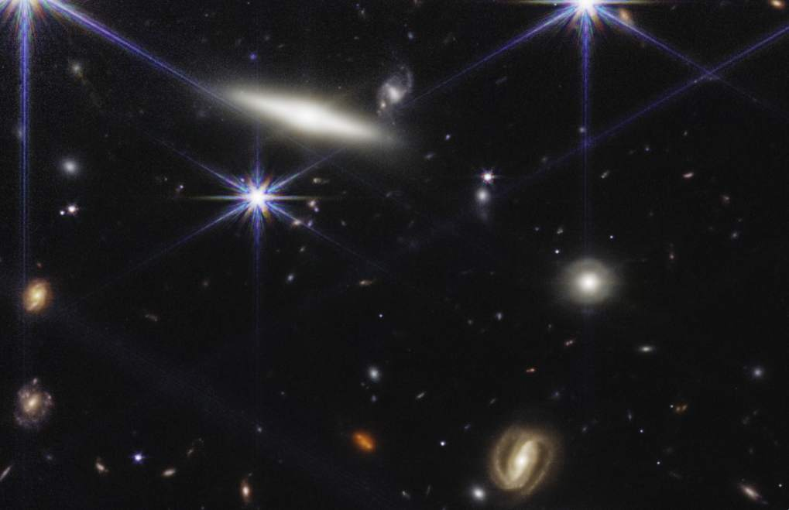
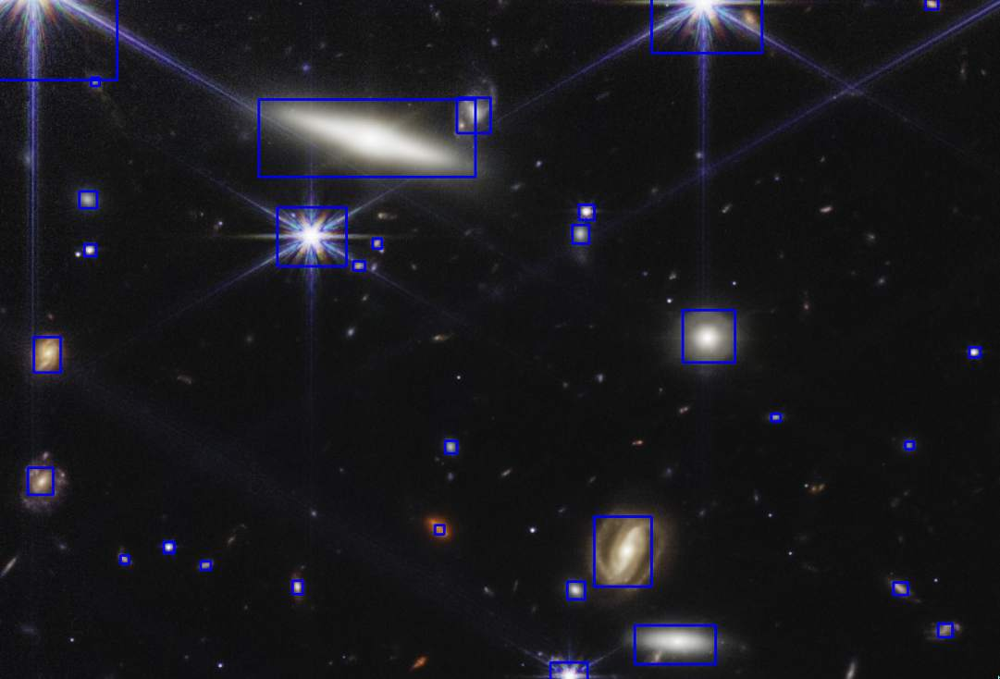
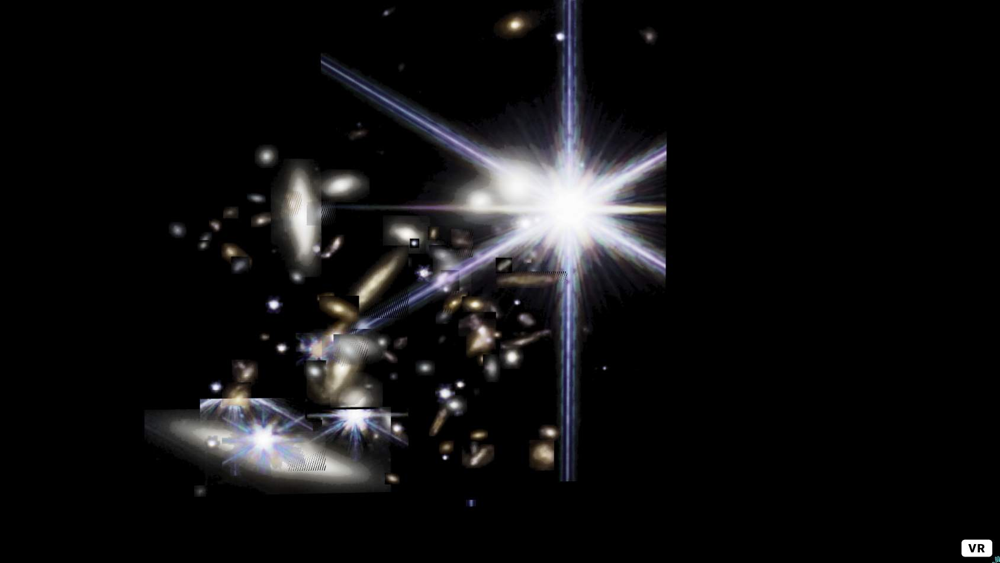
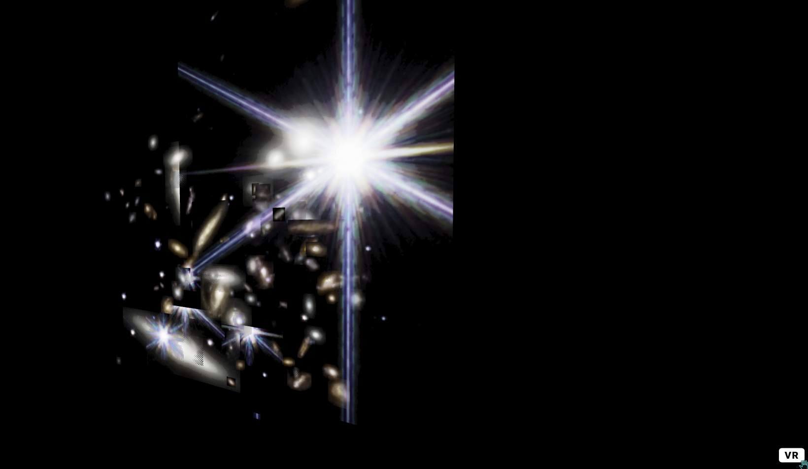

# JWST imagery analysis

## Dependencies

 - `python` 3.6+

```bash
python -m pip install --user opencv-python
python -m pip install --user numpy
python -m pip install --user scikit-image
python -m pip install --user imutils
python -m pip install --user aiohttp

```


## Running

```bash
python -m threedeeify
```


## Progress

TODO

## Research

 - https://pyimagesearch.com/2016/10/31/detecting-multiple-bright-spots-in-an-image-with-python-and-opencv/

## Screenshots

Warning, work-in-progress ugliness ahead.






3D view in a browser (a-frame used to render, also gives the VR capability when viewed in a VR browser.)





